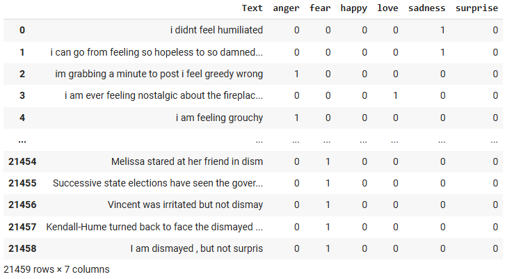
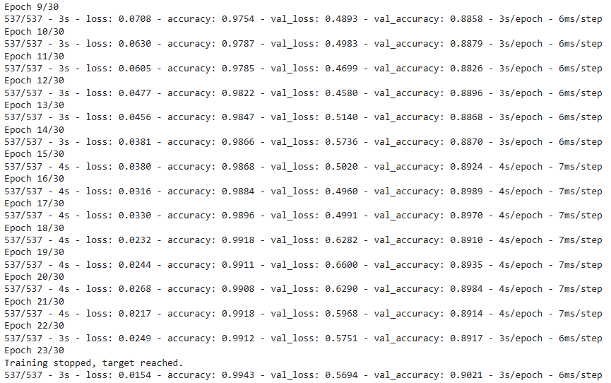

<h1 align="center">
Model classify comments according to emotion
</h1>

Model klasifikasi emosi adalah sebuah sistem kecerdasan buatan yang mampu mengidentifikasi dan mengkategorikan emosi yang terkandung dalam teks, seperti komentar, ulasan, atau postingan media sosial. Model ini dilatih menggunakan algoritme pembelajaran mesin dan data teks yang telah diberi label emosi, seperti "bahagia", "sedih", "marah", "netral", dan sebagainya.

<h2 align="center">
Preview Model
</h2>

  
  

  <!-- 
   -->

<h2 align="center">
Presented By
</h2>
<h3 align="center">Rafi Rachmad Ramadhan</h3>
 
